# 0. SQL Developer 접속

# 1. Select

- projection

- selection

- join 

  ```
  equi join : where = , natural join, inner join, join ~ using
  non-equi join : where between ~ and ~, join ~ on
  self join : 자기 참조 가능, where=FK, join ~ on
  cross join : M * N
  outer join : left outer join, right outer join, full outer join
  ```


# 2. 함수

* custom function
* predefined function : 단일형 함수, 복수형 함수(그룹함수), <b> 윈도우함수</b>

------------------ 지난 번까지 단일형, 복수형 함수를 공부했다. 윈도우 함수를 공부해보자 ------------------------------


## [ window 함수 ]

: grouping 된 row들에 대한 일정한 연산 처리 범위를 갖는다

```sql
select 함수 over (partition by ~ order by ~ nulls last/ nulls first)
		rows range current rows, unbound preceding, unbound following...
from 
where
```

* nulls[ first / last ]오름차순 /  내림차순에 관계 없이 null을 처음/마지막에 올 수 있게 설정


### * 윈도우함수의 종류 *

#### 1 ) 순위 함수

```sql
-- 순위 함수
-- 문제 : 부서별 급여의 내림차순으로 순위를 출력하자
-- 0 단계 : 데이터를 먼저 살펴보자
-- 급여가 동일할 때 순위는 동일하고, 다음 순위는 동일한 순위의 rows만큼 count된 이후의 순위가 나온다
select ename, deptno, sal, rank() over(partition by deptno order by sal desc) sal_rank
from emp;
```

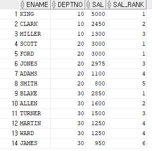

```sql
-- 급여가 동일할 때 순위는 동일하고, 다음 순위는 동일한 순위의 rows만큼 1개의 순위로 처리 되고 이후 순위가 나온다
select ename, deptno, sal, dense_rank() over(partition by deptno order by sal desc) sal_rank
from emp;
```

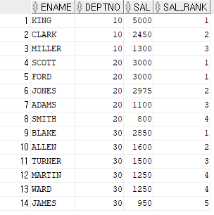

```sql
-- 결과 row에 자동으로 1, 2, 3 순번을 발행해주는 내장 컬럼
-- 1단계
select rownum, ename, sal
from emp;
```

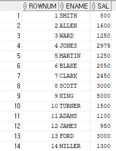

```sql
-- 2단계 : 내림차순을 해보자
select rownum, ename, sal
from emp
order by sal desc; --rownum이 먼저 발행되고, order by절이 처리됨
```

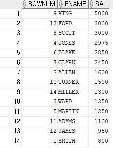

```sql
-- 3단계 : from절을 이용해 order by 절을 먼저 처리하자
select rownum, ename, sal
from (select ename, sal
        from emp
        order by sal desc); --subquery, inline view
```

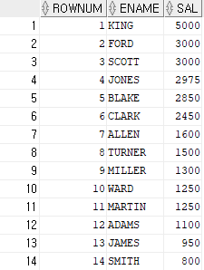

```sql
-- 4단계 : 1 ~ 5등 까지만 출력해보자
select rownum, ename, sal
from (select ename, sal
        from emp
        order by sal desc) --subquery, inline view
where rownum < 6;
```

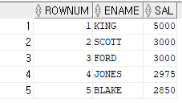

```sql
-- 문제 : 동일한 급여를 받는 사원의 순위를 다르게(차등있게) 출력하자
-- row_number() : orderby 절에 추가 정렬 조건이 없으면 rowid값에 따라 차등적 순위 반환
select ename, deptno, sal, row_number() over(partition by deptno order by sal desc ) rows_no
from emp;
```

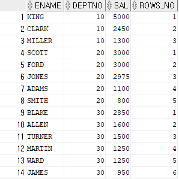

#### 2 ) 집계 함수

```sql
-- 문제 : 부서별 사원의 급여 옆에 누적된 급여 합계를 함께 출력
-- 행기준 : rows , 값기준 : range
select ename, deptno, sal, sum(sal) over (partition by deptno order by sal desc range unbounded preceding) cum_sal
from emp;
```

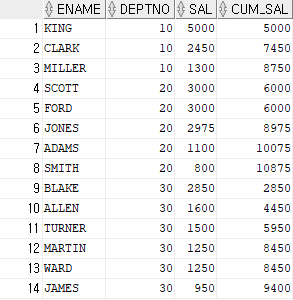

```sql
-- 문제 : 부서별 사원의 급여 옆에 부서의 최대 급여를 함께 출력
-- max 함수 사용
select ename, deptno, sal, max(sal) over(partition by deptno order by sal desc) max_sal
from emp;
```

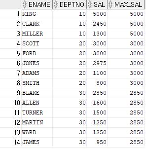

```sql
-- 문제 : 부서별 사원의 급여 옆에 부서의 최대 급여를 받는 사원을 함께 출력
-- first value 사용
select ename, deptno, sal, first_value(ename) over (partition by deptno order by sal desc range unbounded preceding) max_sal
from emp;
```

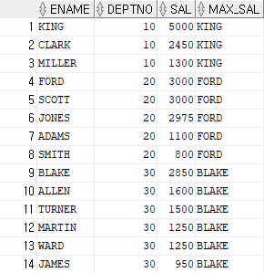

```sql
-- 문제 : 부서별 사원의 급여 옆에 부서의 최소 급여를 함께 출력
-- min 함수 사용
select ename, deptno, sal, min(sal) over(partition by deptno order by sal desc rows between current row and unbounded following) min_sal
from emp;
```

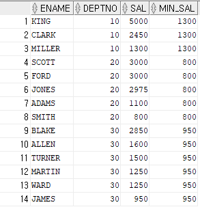

```sql
-- last value 사용
select ename, deptno, sal, last_value(ename) over (partition by deptno order by sal desc rows between current row and unbounded following) min_sal
from emp;
```

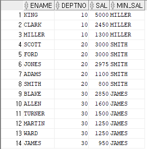

```sql
-- 문제 : 부서별 사원의 급여 옆에 사원보다 급여를 더 많이 받는 1명의 사원과 급여를 더 적게 받는 1명의 급여의 평균을 함께 출력하자
select ename, deptno, sal, avg(sal) over ( partition by deptno order by sal desc rows between 1 preceding and 1 following) "3rows_avg_sal"
from emp;
```

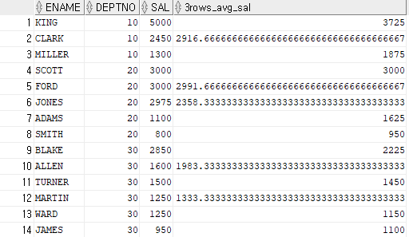

```sql
-- 반올림 해서 나타내보자 : window 절 전체에 round 함수 묶어주기
select ename, deptno, sal, round(avg(sal) over ( partition by deptno order by sal desc rows between 1 preceding and 1 following)) "3rows_avg_sal"
from emp;
```

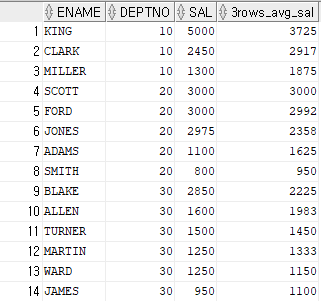

```sql
-- 문제 : 부서별 사원의 급여 옆에 -200 ~ + 200 급여를 받는 사원수를 함께 출력
select ename, deptno, sal, count(sal) over ( partition by deptno order by sal desc range between 200 preceding and 200 following) "+200 ~ -200"
from emp;
```

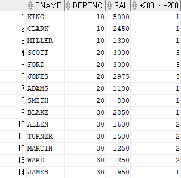

#### 3  ) 행 순서 관련 함수

```sql
-- 행 순서 관련 함수
-- lag(column, n, null|n) : 순서상 내 앞, 뒤의 행을 가져올 때 사용한다
-- lead(column, n, null|n)
-- 문제 : 모든 사원의 급여의 내림차순으로 출력하고, 옆에 자신보다 급여를 많이 받는 사원의 급여와 자신보다 급여를 적게 받는 다음 사원의 급여를 함께 출력
select ename, deptno, sal, 
lag(sal, 1, -1) over (order by sal desc) before,
lead(sal) over (order by sal desc) after
from emp;
```

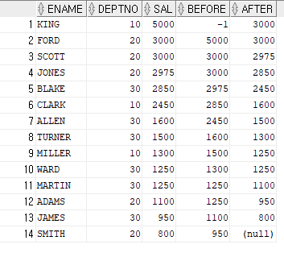

```sql
-- nth_value(column, 순위) : 순위에 해당하는 컬럼값 반환
select ename, deptno, sal,
nth_value(sal,2) over (order by sal desc) before,
nth_value(sal,2) over (order by sal) after
from emp;
```

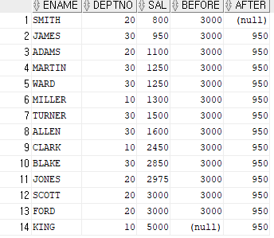

#### 4 ) 비율 관련

```sql
-- 비율 관련 함수
-- ratio_to_report(컬럼) : 파티션 내에 컬럼의 sum값에 대해 행의 컬럼값의 백분율을 반환
-- 0 ~ 1 범위
select ename, deptno, sal,
round(ratio_to_report(sal) over (partition by deptno), 2) as ratio
from emp;
```

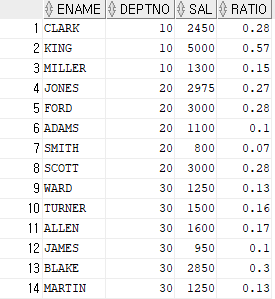

```sql
-- percent_rank(k) : 파티션 내에 행의 순서별 백분율, 제일 먼저 출력되는 행의 순서 백분율을 0, 파티션 내에 마지막 출력되는 행의 백분율은 1
select ename, deptno, sal,
percent_rank() over (partition by deptno order by sal desc) as percent
from emp;
```

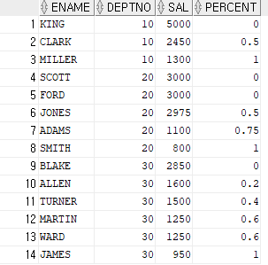

```sql
--ntile : 전체 행을 n등분한 결과 반환, 파티션별 행들을 n등분한 결과 반환
select ename, sal, ntile(4) over (order by sal desc) "4title"
from emp;
```

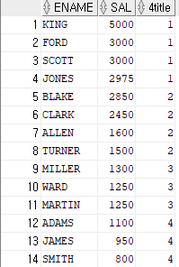

#### 5 ) 상관 분석, 선형 회귀, 분석 함수


