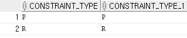
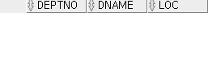

DB에서 데이터를 물리적으로 저장하는 기본 저장객체 : table

table은 행(row, record, tuple, entity, instance)과 열(attribute, column) table에 데이터를 DML 수행시 정합성 규칙(데이터의 품질화 보장) - 제약조건,constaint


constaint는 컬럼에 정의 : NOT NULL, UNIQUE, PRIMARY KEY, FOREIGN KEY, CHECK


table 분류 

1. user table(business data, application data가 저장)

2. database의 메타 정보(테이블 이름, user이름, 컬럼 이름, 권한 정보, 제약조건 정보, 성능)가 저장되는 테이블 = system catalog, data dictionary(view) 라고 부른다

   ```sql
   oracle data dictionary(view) - user_xxxx , all_xxxx , dba_xxxx , v$_xxxx
   conn scott/oracle
   select table_name from user_tables; -- scott소유(생성한)의 테이블 목록
   select table_name from all_tables; -- 소유 + 권한을 받을 테이블목록
   select count(table_name) from all_tables;
   select count(table_name) from dba_tables; -- 권한 불충분 오류
   conn / as sysdba
   select count(table_name) from dba_tables; -- database의 생성된 전체 테이블 정보 확인
   ```

   

   ```SQL
   conn scott/oracle
   ```

   

   

   ```sql
   desc dept
   ```

   

```sql
select constraint_type, constraint_type
from user_constraints
where table_name = 'DEPT'; --테이블에 정의된 제약조건 확인
```


```sql
insert into dept (deptno, dname) values (60, 'IT'); -- 생략된 컬럼값으로 자동으로 null값으로 저장됨
-- 만약에 60이 이미 있으면 제약 조건에 위배되기 때문에 실행이 되지 않는다.
```


```sql
insert into dept values ( 70, 'IT', 'seoul');
```


```sql
select * from dept;
-- 메모리에만 새로운 데이터가 추가됨(명시적으로 DB의 물리적 저장소(file)에 저장시키는 명령어를 실행시켜야 저장됨
-- 세션이 비정상 종료되거나 DB 서버가 비정상종료되면 데이터는 자동으로 rollback
```


```sql
rollback;
```


```sql
select * from dept;
```


null을 허용하면 안되기 때문에 오류가 발생한다.

```sql
insert into dept(dname, loc) values ('web', 'inchon'); 
```


```SQL
select constraint_type, constraint_type
from user_constraints
where table_name = 'EMP';
```




[오류]

1 ) 참조 무결성 오류 : deptno 컬럼 참조

```sql
insert into emp (empno, ename, deptno, hiredate) values(9001, 'kim', 80, sysdate);
```

2 ) 컬럼 사이즈 오류 : 10001 

```sql
insert into emp (empno, ename, deptno, hiredate) values(10001, 'kim', 50, sysdate);
```

3 ) 되야함

4 ) ?


# 예시 2

테이블 생성

```sql
create table student(
grade number(1),
class number(2),
name varchar2(3),
exam number(3) default 50);
```

생성된 테이블 확인

```sql
describe student
desc student
```


테이블을 삭제하려면

```sql
drop table student purge;
```

: purge를 사용하면 복구가 안된다 ~!~!!

[오류 실험]

1 )

```sql
insert into student values(1,1,'Hong',null);
```


2 )

```sql
insert into student values(1,2,'Hong');
```


3 )

```sql
insert into student values(1,2,'Hong',default);
```


4 )

```sql
insert into student values(grade,class,name) values (1,3,'Hong');
```


# 예시 3

테이블 생성

```sql
create table dept2
as select*from dept
where 1 = 2; -- 조건 평가 결과는 false이므로 검색 data가 없으므로 테이블 구조만 복제됨
```

1 )

```sql
desc dept
```


2 )

```sql
desc dept2
```


3 )

```sql
select*from dept;
```


4 )

```sql
select*from dept2;
```



5 )

```sql
insert into dept2
select*from dept
where deptno <=30; -- values절 대신 subquery를 사용
```


6 )

```sql
select*from dept2;
```


# 예시 4

update 테이블명 set 컬럼명 = new_value [ , 컬럼명=new_value, ... ]

update 테이블명 set 컬럼명 = new_value [ , 컬럼명=new_value, ... ]

where 조건; -- 조건을 만족하는 row만 변경됨

```sql
select sal from emp;
update emp set sal = 0; -- 모든 레코드의 sal 컬럼 값이 단일값으로 변경
select sal from emp;
rollback;
update emp set sal = sal * 1.1;
select sal from emp;
rollback;
update emp set sal = sal*1.1 where deptno = 20;
```

변경할 컬럼에 제약조건, 함수, null, default 등이 적용됨

만약, 사번을 변경하는데 최대자리수가 4자리이므로 5자리로 변경할 수 없다


###### 문제 : smith 사원의 급여를 scott 사원의 급여와 동일하도록 변경하시오

```sql
update emp set sal = (select sal from emp where ename = 'SCOTT')
where ename = 'SMITH';
--update의 set절, where절에 subquery 사용 가능
select sal
from emp
where ename in ('SMITH', 'SCOTT');
```


레코드 단위로 삭제

delete from 테이블명; -- 테이블의 모든 행 삭제

delete from 테이블명 where 조건; -- 조건을 만족하는 행만 삭제

```sql
select count(*) from emp;
```


```sql
delete from emp;
select count(*) from emp;
```


```sql
delete count(*) from emp;
```


```sql
delete from emp where deptno = 20;
```


```sql
select count(*) from emp;
```


```sql
select deptno from emp;
```


rollback 해주기


##### 문제 :  smith 사원과 동일한 직무를 담당하는 사원들 삭제

delete from 테이블명 where 조건 컬럼 = (subquery)

```sql
delete from emp where job = (select job from emp where ename='SMITH');
select count(*) from emp;
```


# merge문

: ETL 작업에 유용

join 조건에 따라 insert, update 수행, update 결과 조건으로 delete도 함께 수행

merge into 타겟테이블 + 별칭(alias)

using 소스테이블 + 별칭

on (타겟테이블.pk 컬럼 = 소스테이블.pk 컬럼)

when matched then

​	update set 타겟테이블의별칭.컬럼 = 소스테이블의 별칭.컬럼, ...

​	[delete where 조건]

when not matched then

​	insert (t.column, t.column, t.column,  ... )

​	values ( s.columns, s.column, s.column, ... )

```sql
create table tiny_emp
as select empno, ename, deptno, sal, job
    from emp
    where deptno = 10;
select * from tiny_emp;
```


##### 문제 : emp의 데이터를 tiny_emp로 이관하세요. tiny_emp 테이블에 이미 레코드가 존재하면 급여를 10% 인상하고, 인상된 급여가 5000보다 크면 삭제하고, tiny_emp테이블에 emp테이블의 데이터가 존재하지 않으면 emp의 데이터를 insert하시오

```sql
merge into tiny_emp t
using emp s
on (t.empno = s.empno)
when matched then
    update set t.ename = s.ename, t.deptno=s.deptno, t.sal=s.sal*1.1, t.job=s.job
    delete where t.sal > 5000
when not matched then
insert(t.empno, t.ename, t.deptno, t.sal, t.job)
values(s.empno, s.ename, s.deptno, s.sal, s.job);
select * from tiny_emp;
```


