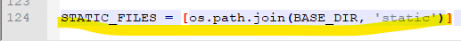
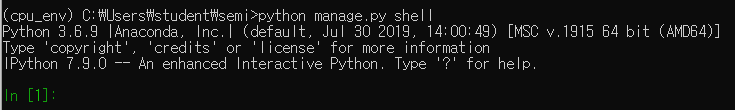
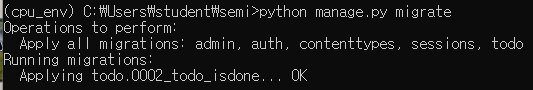

# Django


webserver에서 url 요청이 들어오면 장고 urlresolver가 무엇을 할지 확인한다( 글쓰기, 글 수정 등등 )

잔고에서 controller 역할을 하는게 view함수이다

---------------------

 


주소를 입력하면 

http://localhost:8000/admin 입력하고 cmd 엔터


---------


파일 열어서 installed_apps에 구현할 내용 입력


----


db를 사용할 수 있다 ( 무료로 사용 가능 )

- oracle로 변경 할 수 있다

------------


정적인 페이지가 있을 때 

-------------


language 한국어로 바꿔보자, time-zone도 바꿔보자

-------------


local host, ip address 추가 가능


['70.12.116.171', 'localhost'] 

--------

Installed_Apps 에 구성할 내용을 추가

* templates
* 


* static file 을 어디에 구성할 것인가?
* 

------------

프롬프트창에서


이 폴더가 생긴다

얘를 다시 semi 폴더 안의 settings.py 에 들어가서


installed_apps에 넣어주자.

------------------------

1 ) todo 폴더 안의 urls 로 접속


2 ) todo 안의 urls file은 view를 보여주게 한다


3 ) todo 폴더 안의 view는 다음과 같이 출력한다


4 ) 홈페이지에 들어가면 다음과 같이 보인다


----------


1 ) todo 폴더 안에 templates 폴더 안에 새로 todo 폴더 만들고 그 안에 index.html 저장

2 ) index.html 생성

```html
<html lang="ko">
<head>
    <meta charset="UTF-8">

    <!-- Boot strap -->
    <!-- 합쳐지고 최소화된 최신 CSS -->
    <link rel="stylesheet" href="https://maxcdn.bootstrapcdn.com/bootstrap/3.3.2/css/bootstrap.min.css">
    <!-- 부가적인 테마 -->
    <link rel="stylesheet" href="https://maxcdn.bootstrapcdn.com/bootstrap/3.3.2/css/bootstrap-theme.min.css">
    <!-- 합쳐지고 최소화된 최신 자바스크립트 -->
    <script src="https://maxcdn.bootstrapcdn.com/bootstrap/3.3.2/js/bootstrap.min.js"></script>

    <style>
        .content{
            height: 75%;
        }
        .messageDiv{
            margin-top: 20px;
            margin-bottom: 50px;
        }
        .toDoDiv{

        }
        .custom-btn{
            font-size: 10px;
        }
        .panel-footer{
            height:10%;
            color:gray;
        }
    </style>

    <title>To-Do</title>
</head>
<body>
    <div class="container">
        <div class="header">
            <div class="page-header">
                <h1>To-do List <small>with Django</small></h1>
            </div>
        </div>
        <div class="content">
            <div class="messageDiv">
                <form action="" method="POST">
                    <div class="input-group">
                        <input id="todoContent" name="todoContent" type="text" class="form-control" placeholder="메모할 내용을 적어주세요">
                        <span class="input-group-btn">
                            <button class="btn btn-default" type="submit">메모하기!</button>
                        </span>
                    </div>
                </form>
            </div>

            <div class="toDoDiv">
                <ul class="list-group">

                    <form action="" method="GET">
                        <div class="input-group" name='todo1'>
                            <li class="list-group-item">메모한 내용은 여기에 기록될 거에요</li>
                            <input type="hidden" id="todoNum" name="todoNum" value="1"></input>
                            <span class="input-group-addon">
                                <button type="submit" class="custom-btn btn btn-danger">완료</button>
                            </span>
                        </div>
                    </form>

                </ul>
            </div>
        </div>
        <div class="panel-footer">
              Django 프레임워크기반 웹 프로젝트 Todo 웹앱 
        </div>
    </div>
</body>
</html>
```

3 ) view.py 에서 어떤걸 return 받을지 


4 ) 결과


-----------

[ 여기까지 복습하자면!! ]

todo.urls -> views.py ->index.html 생성 -> return HTTPRequest -> render(html)

* html 은 정적이므로 templates/todo/index.html 파일을 저장해주자

----------


위의 것에 입력하면 todo>templates>todo>index.html 의 action안에 무슨 일을할지 설정해주자


=> url 요청을 처리하기 위해서 다음의 작업을 처리해야한다.

1 ) url 입력

2 ) 함수 정의

3 ) 함수의 views.py 에 함수정의

4 ) 모델 정의 ( class로부터 객체를 생성해서 이 객체에 전송된 데이터를 저장해서 db에 저장 )

5 ) django 와 db 연동은 settings.py에 하자 

--------

* model 설정해주자 : todo > models.py 열기

  ```python
  from django.db import models
  
  # Create your models here.
  
  class Todo(models.Model):
      content = models.CharField(max_length = 255)
      # model의 property를 설정할 수 있다 (charfield, textfield, filepathfield 등등)
  ```

  Todo 라는 table에 content라는 column이 생성된다

- 데이터를 만들어주는 작업을 anaconda에서 해준다

  

아래와 같이 줄줄줄 나온다


그 다음에 shell 입력




exit()로 나가면 된다.

--------

todo > templates > todo > index.html에서 action을 추가하자.


todo > urls.py에 view함수 정의


todo > views.py에  createTodo 생성


크롬에서


라고 입력한 뒤 메모하기 버튼 누르면


url이 넘어가진다!

------

[ 다른 view 함수를 정의해보자 ]

todo > views.py에서 다음과 같이 작성


todo > templates > todo > index.html에서


todo > urls.py에서 


todo > views.py


이렇게 나온다

--------

완료버튼을 누르면 화면에서 없애자

- db에서 삭제해도 되고 안해도 된다

todo > models.py


아래를 다시 수행해준다




todo > urls.py 에서


todo > templates > todo > index.html에서


todo > views.py


todo > templates > todo > index.html에서


완료버튼 누르면 없어짐