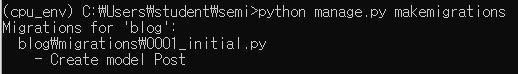
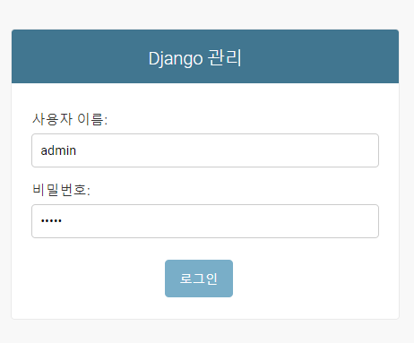
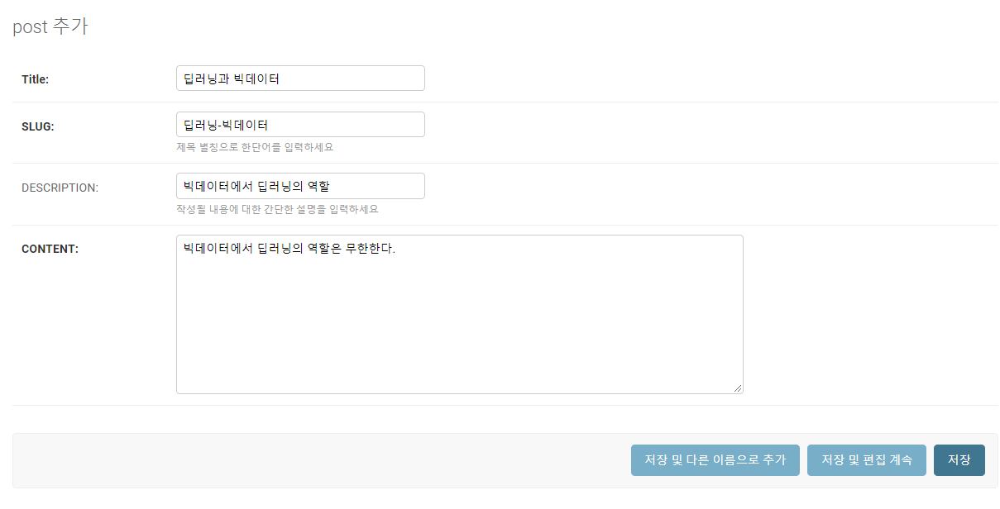
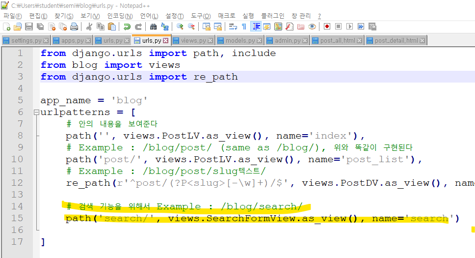

# 1 . 로그인 창 만들기

activate cpu_env


이렇게 새로운 폴더가 생긴다

-------

semi -> semi -> settings.py


확인해보자


이렇게 생성되어 있다

url을 만들어주자

semi -> semi -> urls.py


------


여기에 urls.py가 없기 때문에 만들어주자


```
http://~~~/blog를 요청했더니 
-> semi의 urls.py에서 요청을 받는다 
-> 얘는 다시 blog의 urls.py를 요청한다
-> 얘는 다시 views.py를 요청한다
-> views.py에 PostLV를 추가해주자
```

------

blog-> models.py 에서 모델을 만든 뒤 views.py에서 모델을 부르는 객체(class)를 생성하자

다음과 같이 입력

```python
from django.db import models
from django.urls import reverse

# Create your models here.
class Post(models.Model):
    title = models.CharField(verbose_name='title', nax_lengthb=50)
    # 내가 작성한 글이 어떤 것과 연관되었는지 알려주는 기능
    # help_text : 한 단어만 입력하도록한다
    slug = models.SlugField('SLUG',unique=True, allow_unicode=True, help_text='제목 별칭으로 한단어를 입력하세요')
    description = models.CharField('DESCRIPTION', max_length = 100, blank=True, help_text='작성될 내용에 대한 간단한 설명을 입력하세요')
    content = models.TextField('CONTENT')
    create_dt = models.DateTimeField('CREATE DATE', auto_now_add=True)
    modify_dt = models.DateTimeField('MODIFY DATE', auto_now = True)
    
    class Meta : 
        verbose_name = 'post'
        verbose_name_plural = 'posts'
        db_table = 'blog_posts' # db에 저장되는데 그 테이블 이름
        ordering = ('-modify_dt',) # 수정된 날짜 내림차순
        
       
    def __str__(self) : 
        return self.title
        
    # 절대경로
    def get_absolute_url(self) :
        # post_detail : 글을 클릭하면 내용을 볼 수 있는 상세 페이지를 만든다
        return reverse('blog:post_detail', args = (self.slug,))
        
    # 이전 페이지 만들어주자
    def get_previous(self) :
        return self.get_previous_by_modify_dt()
        
    # 다음 페이지를 만들어주자
    def get_previous(self) :
        return self.get_next_by_modify_dt()
```


이제  blog -> views.py 에서 생성한 모델을 불러오자


```python
from django.shortcuts import render
from django.views.generic import ListView
from blog.models import Post
# Create your views here.

# 모델을 정의해야한다
class PostLV(ListView) :
    model = Post
    # url 요청을 하면 그 요청정보를 다음에 보낸다
    template_name = 'blog/post_all.html'
    # context에서 사용할 object
    context_object_name = 'posts'
    # page 처리를 몇개씩?
    paginate_by = 2
```


아나콘다 창에서 migrate



+ python manage.py migrate

python manage.py runserver

크롬창에 localhost:8000/admin 입력하면


------------

관리자 계정을 만들어준다




로그인을 해보자


이런 창이 나온다

----

# 2. 게시글 추가하기

blog -> admin.py


```python
from django.contrib import admin
from blog.models import Post

# Register your models here.
@admin.register(Post)
class PostAdmin(admin.ModelAdmin) : 
    list_display = ('id', 'title', 'modify_dt')
    list_filter = ('modify_dt',)
    search_fields = ('title', 'content')
    # 위는 다 변경 불가능, 아래는 변경 가능한 dict
    prepopulated_fields = {'slug' : ('title',)}
```





위에 요렇게 뜬다

--------

# 3. 게시글을 한 군데서 보여주기


blog 폴더 아래 templates 폴더 아래 blog 폴더를 만들어주자( 연습용으로 )


http://localhost:8000/blog/ 입력하면


이렇게 나온다

------------------------------------------------------------------

ver2 만들어보자


요렇게 나온다

---------

< 아직 안한 거 >

1 ) 제목 누르면 상세보기 페이지로 넘어가게 처리

2 ) 다음 페이지, 이전 페이지 처리

----------------------

# 4. 게시글의 상세페이지 확인, 페이지 이동하기

## 1 ) 게시글의 상세 페이지 확인

blog> post_all.html


```
        # blog(앱 이름)의 post_detail(views.py)안의 view함수를 부른다
        # view 함수에 지정된 html을 응답하자
        # args : title이 너무 길 때 별칭을 같이 넘긴다는 뜻
        # post_detail이라는 url을 추가하자 = blog/post/slug로 요청하면 post_detail로응답
```

blog/post/리스트 와  blog/post/slug/post_list, 두 가지를 만들어보자

-------------

blog > urls.py


```python
from django.urls import path, include
from blog import views
from django.urls import re_path

app_name = 'blog'
urlpatterns = [
    # 안의 내용을 보여준다
	path('', views.PostLV.as_view(), name='index'),
    # Example : /blog/post/ (same as /blog/), 위와 똑같이 구현된다
    path('post/', views.PostLV.as_view(), name='post_list'),
    # Example : /blog/post/slug텍스트/
    re_path(r'^post/(?P<slug>[-\w]+)/$', views.PostDV.as_view(), name='post_detail'),
    
]
```


view에 PostDV가 없으므로 PostDV를 정의하자 ( class로 지정할 것이므로 model또한 만들어주자)

blog > views.py : PostDV정의


blog > templates > blog 안에 post_detail.html 파일을 생성한다


홈페이지에서 확인해보자

http://localhost:8000/blog/


이렇게 나오는데 제목을 클릭하면??


상세 페이지가 나온다 !

-----------

## 2 ) 게시글의 이전, 다음페이지로 이동

이전 페이지, 다음 페이지를 만들어보자


page_obj.number : 현재 페이지

page_obj.paginator.num_pages : 전체 페이지


post_all.html에서


```html
<div>
<span>
	<!-- 이전 페이지 -->
	
		<a href='?page={{page_obj.previous_page_number}}'>PreviousPage</a>
	
	
	<!-- 현재 페이지 -->
	Page	{{page_obj.number}} of {{page_obj.paginator.num_pages}}
	
	<!-- 다음 페이지 -->
	
		<a href='?page={{page_obj.next_page_number}}'>NextPage</a>
	
</span>
</div>
```

결과를 보면 ? 

=> 2 page에  있어서 안 보였던 애들을 볼 수 있게 되었다 !!


왜 한 페이지에 두개의 글만 나올까??

왜냐면 blog > views.py 안에서

```
paginate_by = 2
```

얘를 2로 설정해두었기 때문이다 !!

데이터를 admin page에서 조금 더 추가해보았다.

--------

# 5. 게시글 제목, 설명, 내용에서 단어를 검색하기

blog > urls.py



blog > views.py 에서 새로운 class를 만들어주자


---

파이썬 파일을 하나 만들어주자( blog > forms.py)


forms.py 안에 입력하자


------

blog > templates > blog 안에 post_search.html 파일 생성


blog > templates > blog > post_searh.html 에서


```html
<h1> Blog Search </h1>
<br>

<form action="." method="post"> 
	{{ form.as_table }}
	<input type="submit" value = "검색">
</form>

<br /><br />


	
		<h3><a href ='{{ post.get_absolute_url }}'>{{ post.title }}</a></h3>
		{{ post.modify_dt|date:"N d, Y" }}
		<p>{{ post.description }}</p>
	

<b><i>Search Word({{ search_term}}) 찾는거 없네유 </i></b>

```

blog > views.py에서


```python
#--- FormView
class SearchFormView(FormView):
    # PostSearchForm 이라는 class를 만들고
    form_class = PostSearchForm
    # post_search html도 만들고
    template_name = 'blog/post_search.html'
    
    # 검색어와 폼 두가지가 넘어온다
    def form_valid(self, form):
        searchWord = form.cleaned_data['search_word']
        # 제목에 있으면 title_icontains 
        # 설명에 있으면 description_icontains에서 찾을수 있도록한다
        # 내용에
        # 근데 제목, 설명, 내용에 모두 찾고자하는 단어가 있으면 똑같은 값을 세번 가져올 것이기 때문에 distinct로 중복을 제거해주자
        post_list = Post.objects.filter(Q(title__icontains=searchWord) | Q(description__icontains=searchWord) | Q(content__icontains=searchWord)).distinct()
        # 빈 dict를 만들어서
        context = {}
        context['form'] = form
        context['search_term'] = searchWord
        context['object_list'] = post_list
        
        return render(self.request, self.template_name, context)
```

----

localhost:8000/blog/search


단어를 입력하면


요렇게 나온다

----------------

